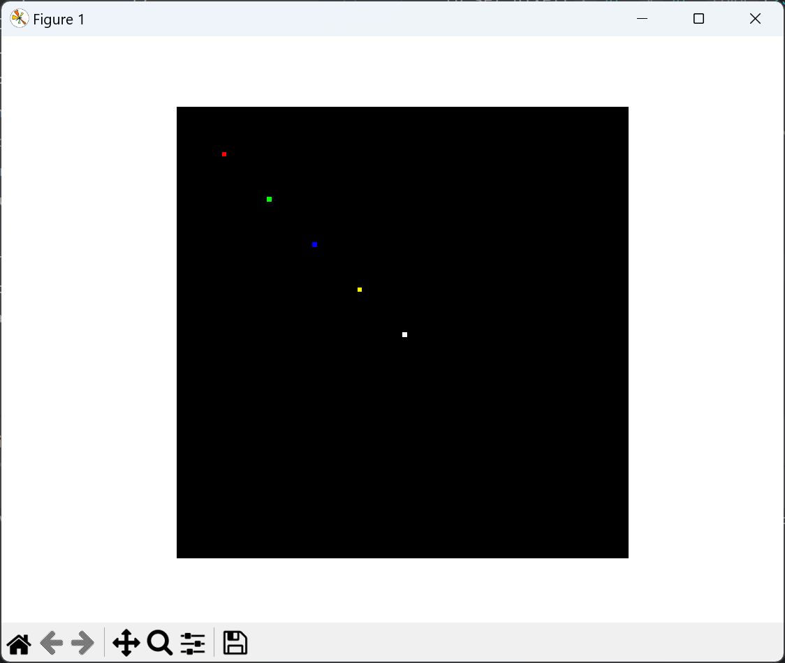
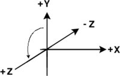
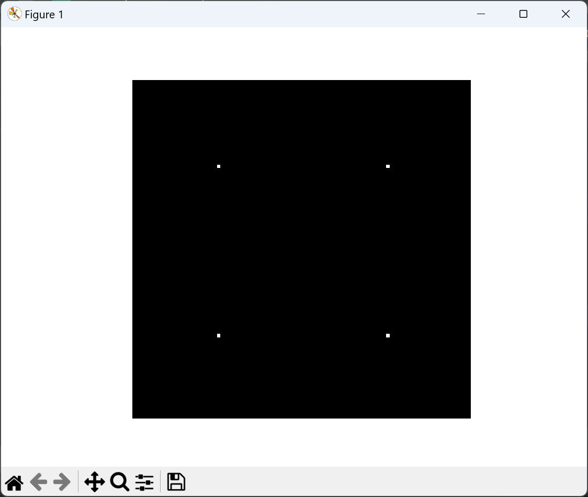
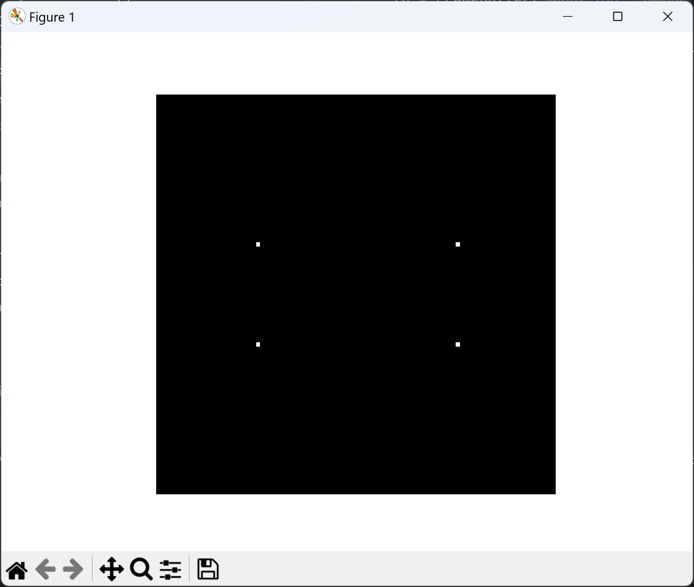
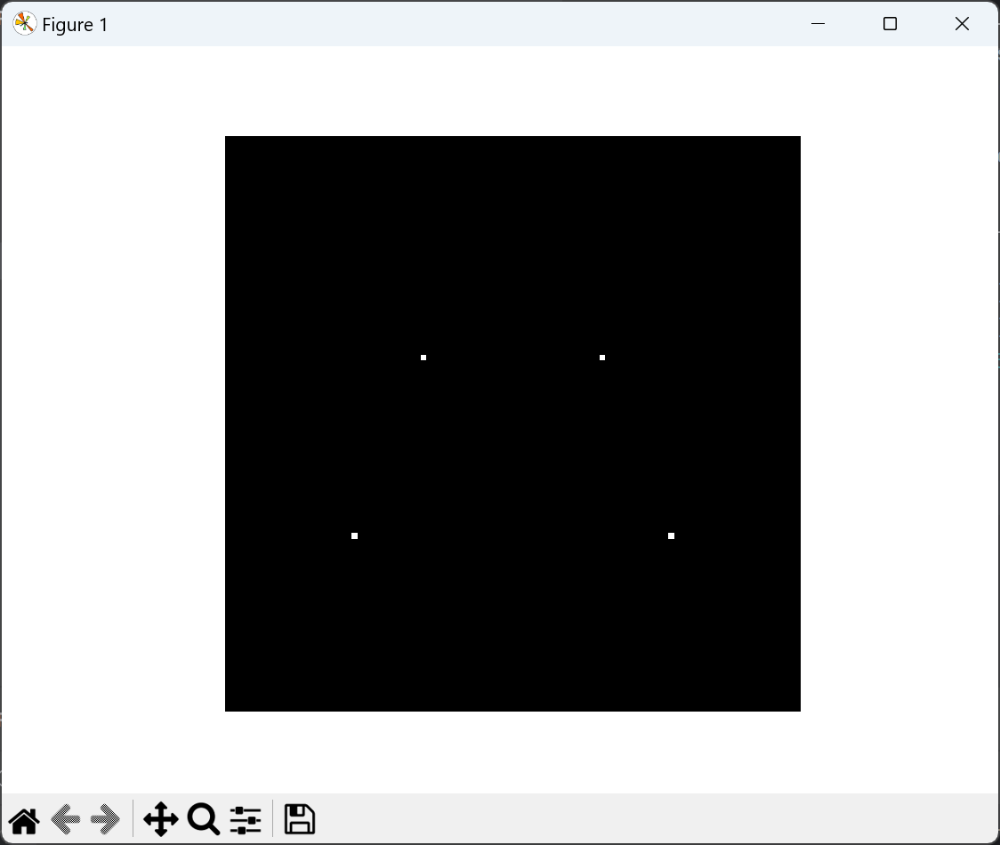

# JackieEngineMini

- 一个用Python编写的软光栅渲染器（Software Rasterizer）
- 本项目用简洁易懂的代码，实现了软光栅编写中，易错困难的部分（管线、透视纠正、齐次坐标裁剪）
- 本项目追求代码的简洁易懂，而并不过分追求性能
- 需要高性能，请使用我的另一个使用C++编写的软光栅渲染器 `JackieEngine`

## 关于性能

- 虽然Python性能有限，但是经过优化后，也可以实现流畅：100x100分辨率下，能达到25FPS
- Python具有易于编写、快速迭代的特性，进行新功能实验和Debug
- 例子：同样实现透视纠正的纹理渲染，C++项目编写时长大约2星期，而Python项目只用了1天
- 所以，这个项目能够节省编码、调试时间，虽然会牺牲一点运行时间

## 我该如何学习图形学？

- 这个项目代码虽然简单易懂，但仍然需要你有一定计算机图形学的基础知识，才能无障碍阅读

- 推荐一门很好的课程：加州大学圣芭芭拉分校 闫令琪教授的课程：“GAMES101-现代计算机图形学入门”

  参考资料：https://www.bilibili.com/video/BV1X7411F744

- 在编写您自己的软光栅渲染器时，难免会遇到困难的Debug挑战，有时候需要1-2周才能找出问题

- 本项目用简洁易懂的代码，实现了软光栅编写中，易错困难的部分（管线、透视纠正、齐次坐标裁剪）

- 通过阅读这个项目的代码，您能快速参考、对照，从而实现如虎添翼的Debug体验

- 以下是完善的开发日志，将软光栅开发中的坑，都列出来，方便大家快速Debug：

## 技术路线图

根本功能：

- ✓ 透视投影（Perspective Projection）

  关键在于**理解FoV（Field of View）**，明白为什么使用默认算法，得到的FoV是45度

- ✓ 光栅化（Rasterization）

  关键在于**遵守左上规则（Top-Left Rule）**，做到不重不漏，这是光栅化最容易出错的地方

- ✓ 纹理映射、透视纠正（Texture Mapping & Perspective Correction）

  关键在于**理解1-z空间（1-z Space）**，明白：线性变换产生仿射插值（Approximate Interpolation）；非线性变换产生透视插值（Perspective Interpolation）；后者才是正确的

基础功能：

- 环绕相机（Orbit Camera）

  关键在于**实现惯性延迟效果**，也就是你刷手机文章时，往上滑动，松手了还会继续滑动的惯性效果。实现了这种效果，环绕相机的手感才能**不再生硬，变得丝滑趁手**。

- 齐次空间裁切（Homogeneous Clipping）

  必不可少的功能，如果没有裁切，**三角形超出屏幕边界**，程序就会立即闪退。

- 背面剪切、深度缓冲（Backface Culling & Z-Buffer）

  必不可少的功能。首先，背面剪切，**能减少约50%的渲染负荷**，极大地提升性能。接着，深度缓冲，能解决背面剪切搞不定的**重叠关系处理**，解决渲染错误的问题。

进阶功能：

- 加入好看的OBJ贴图模型（可以使用Assimp加载库）
- 加入好看的天空盒子（可以使用渲染技巧）

高级功能：

- 布林冯反照模型（Blinn-Phong Reflectance Model）
- 逐平面渲染，平渲染（Flat Shading）
- 逐顶点渲染，高若德渲染（Gouraud Shading）
- 逐像素渲染，冯渲染（Phong Shading）

画面优化：

- 伽玛矫正（Gamma Correction）
- HDR 与 ACES Tonemapping

## 1.1. 创建帧缓冲（Frame Buffer）

本项目用 Numpy + Matplotlib，快速实现了一个帧缓冲，能够绘制像素到屏幕上：



代码参见：

```
M01SimpleProjector/C01SimpleFrameBuffer.py
```

## 1.2. 建立座标系，创建简单的模型

有两种选择：

- 左手坐标系：Direct 3D使用，数学推导有一些小便利，但是网上的公式一般是右手系的，需要你自己转换
- **右手坐标系：OpenGL、Vulkan使用，数学上有些麻烦，因为Z轴有负号，但是通用，性价比很高**

这里我们选择右手座标系（注意到Z轴是反的，因此，之后公式里会一直出现负号）：



参考资料：https://www.evl.uic.edu/ralph/508S98/coordinates.html

建立好坐标系后，我们简单定义出一个四边形（Quad）的顶点坐标，带上一个可变的旋转角度theta。

以下是数学公式推导的图纸：

PLACE HOLDER PLACE HOLDER PLACE HOLDER PLACE HOLDER PLACE HOLDER

以下是实现代码：

```python
def GeneratePoints(theta):
    # Order: X-Y-Z; OpenGL Right Hand Coordination System

    A = [np.float64(-1), np.sin(theta), -np.cos(theta)]
    B = [np.float64(1), np.sin(theta), -np.cos(theta)]
    C = [np.float64(-1), -np.sin(theta), np.cos(theta)]
    D = [np.float64(1), -np.sin(theta), np.cos(theta)]

    return [A, B, C, D]
```

代码参见：

```
M01SimpleProjector/C02QuadPoints.py
```

定义好后，我们还不能马上看到图片，得进行下一步。

## 1.3. 正交投影（Homogeneous Projection）

正交投影公式很简单，很好编程实现，能快速帮我们看到自己定义的坐标：

```
from 3D (x, y, z) => 2D (x', y')
x' = x
y' = y
```

效果是这样的（theta=pi/2时）：



已经有一个四边形（Quad）的样子出来了！

我们尝试把theta调成为pi/6，会发现，没有近大远小的效果：



这是正常现象，因为正交投影就是没有近大远小的。因此，我们要改为使用透视投影。

代码参见：

```
M01SimpleProjector/C03HomoProjection.py
```

## 1.4. 透视投影（Perspective Projection）

透视投影公式也不难，其实就是把XY坐标除以Z轴坐标：

```
from 3D (x, y, z) => 2D (x', y')
x' = x / -z
y' = y / -z
```

为什么除以Z轴坐标呢？我有一个很通俗的解释：

- Z轴坐标绝对值越大，代表物体越远
- 又因为使用除法，所以除数越大，商越小
- 这样，远的物体 => Z绝对值大 => X / Z小 => 看起来就会显得小，反之亦然

实现了透视投影后，效果是这样的（theta=pi/4时）：



可以看到，近大远小的效果出来了，还挺好的！

代码参见：

```
M01SimpleProjector/C04PerspProjection.py
```

> ### 知识扩展：为什么使用默认公式，会产生 FoV = 45 Deg的效果？
>
> PLACE HOLDER PLACE HOLDER PLACE HOLDER PLACE HOLDER PLACE HOLDER

